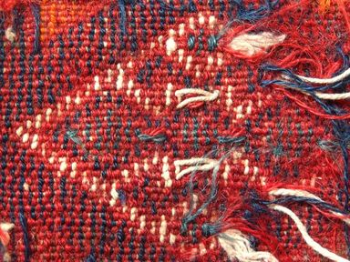

# Concurrency in Go material

Golab 2019, 2019-10-22, 14:30-16:00, Florence

A short introduction to basic Go patterns.

## Goals

Implement a few little projects that demonstrate primitives:

* goroutines
* channels
* select
* sync.WaitGroup
* sync.Once
* context

There are slides:

* [Slides](Slides.md) ([PDF](Slides.pdf))

Exercises and examples are in:

* [x directory](x)

Solutions can be found here:

* [solutions](solutions)
