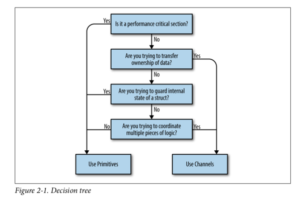

# Robust concurreny

Implementing basic concurrency patterns.

[GOLAB 2019](https://golab.io), 2019–10–22, 14:30-16:00, Florence
[Martin Czygan](mailto:martin.czygan@gmail.com)

----

# About me

SWE [@ubleipzig](https://ub.uni-leipzig.de).


* Leipzig University Library is involved in a variety of open source projects in
  the library domain: catalogs, repositories, digitization and image interop
  frameworks (IIIF), data acquisition, processing and indexing tools
* Go for tools and services
* Co-organizer of [Leipzig Gophers](https://golangleipzig.space)

----

# Background

Moderate use of classical concurrency tools, like threads (in Java) or
multiprocessing. Use case: implementing data and legacy system access tools.
Code is slow (for many reasons). Investigating parallelization approaches.
Discover ZeroMQ, which looks like an embeddable networking library but acts like
a concurrency framework.

Patterns, resulted in faster tools. Discovered sequential, than concurrent Go.
Better resource utilization. Small parallel tools.

----

# Goal

Get more familiar with a few primitives and patterns.

* Slides
* Example code
* A few exercises
* Pop quizzes with questions related to a [paper](https://songlh.github.io/paper/go-study.pdf) 

----

# Paper: Understanding Real-World Concurrency Bugs in Go

* Looked at Docker, k8s, etc, CockroachDB, gRPC-Go, BoltDB

> We made nine high-level key observations of Go concurrency bug causes,
fixes, and detection.

Axes:

* Classic vs CSP style primitives
* Blocking vs Nonblocking bugs

If not noted otherwise, "Paper" will refer to this paper.

----

# Three little projects

* A generic parallel line processing function.
* Fan-out indexing with solrbulk and esbulk.
* Hedged request with networked version of the fortune command.

----

# Concurrency is hard

It's so hard, you may want to avoid it completely.

* Example: x/hard

Advice from https://golang.org/ref/mem

> Don't be clever.

----

# Example: x/hard

Question: What do you think can happen?

----

# Example: x/hard

* nothing is printed
* value = 0
* value = 1

----

# Example: x/hard

> Most of the time, **data races are introduced because the developers are
thinking about the problem sequentially**. They assume that because a line of code
falls before another that it will run first. They assume the goroutine above
will be scheduled and execute before the data variable is read in the if
statement. (CIG)

----

# Go memory model

> Many compilers (at compile time) and CPU processors (at run time) often make
> some optimizations by **adjusting the instruction orders**, so that the
> instruction execution orders **may differ from the orders presented in code**.
> **Instruction ordering** is also often called **memory ordering** (GO101)

----

# Go memory model

Happens-before.

> Within a single goroutine, reads and writes must behave as if they executed in
> the order specified by the program. That is, compilers and processors may
> reorder the reads and writes executed within a single goroutine only when the
> reordering does not change the behavior within that goroutine as defined by
> the language specification. 

*Within a single goroutine, the happens-before order is the order expressed by
the program.*

----

# Go memory model

> Within a single goroutine, there is no concurrency, so the two definitions are
> equivalent: a read r observes the value written by the most recent write w to
> v. When multiple goroutines access a shared variable v, they **must use
> synchronization events to establish happens-before conditions that ensure
> reads observe the desired writes**.

----

# Example: x/hardsleep

```go
	// Note: Extensive testing found 5µs to be the ideal time to have chance to
	// observe different results on subsequent runs. Works on my machine.
	time.Sleep(5 * time.Microsecond)
```

----

# Example: x/hardsleep

> The takeaway here is that you should always target logical correctness.
Introducing sleeps into your code can be a handy way to debug concurrent
programs, but they are not a solution. (KCB)

----

# Pop quiz

The paper looks at goroutine creation sites (go keyword). Named and anonymous
functions can be used.

Question: What is more frequent?

* A: named functions
* B: anonymous functions
* C: depends on the project

----

# Pop quiz

Question: What is more frequent?

* B: anonymous functions
* C: depends on the project

Only BoltDB is different, otherwise anonymous functions seem to be more popular.

----

# Go concurrency primitives

Go support classic and CSP style. Which one do you choose? (KCB)



----

# Pop quiz

The gRPC project has several implementations, e.g. C or Go. The Paper discribes
the ratio of normal source lines and goroutine / thread creation sites as
goroutine / thread creations per 1000 lines of code.

* Example: 1 go statement per 1000 lines would be: 1.

Question 1: What do you think this ratio is for the gRPC-Go project?

* A: 0.083
* B: 0.83
* C: 8.3

Question 2: Is the ratio for gRPC-C higher or lower?

* A: higher
* B: lower

----

# Pop quiz

Answer: B, B.

* gRPC-Go: 0.83, gRPC-C: 0.03

It seems that people use the facilities available.

----

